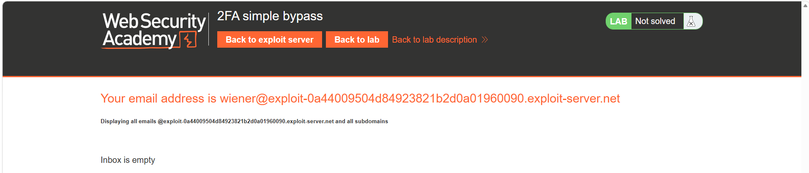
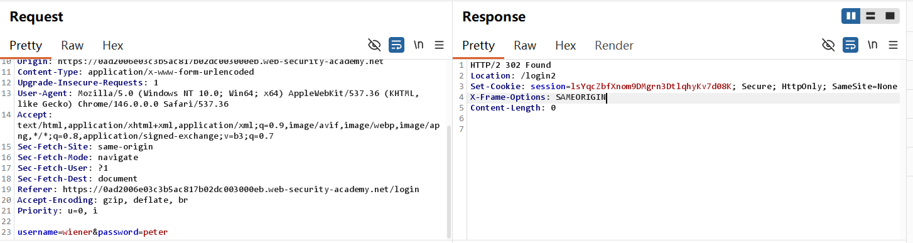
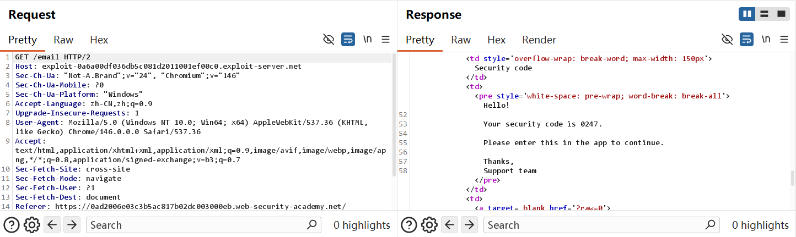
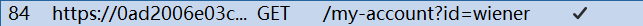
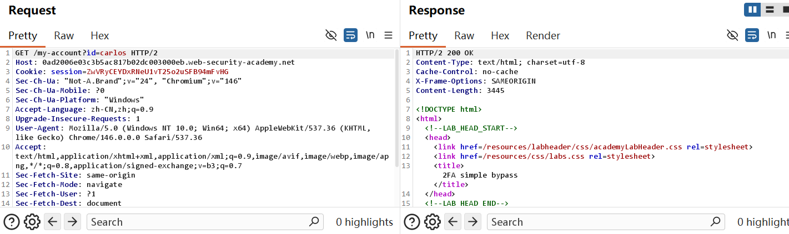
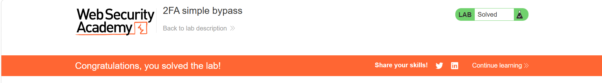

## 2FA simple bypass-Burp 复现

## 实验信息

- 平台：PortSwigger Web Security Academy
- 漏洞：Authentication
- Lab: 2FA simple bypass
- 难度：Apprentice

## 漏洞原理
该漏洞属于authentication身份认证漏洞，原理是2 FA bypass(双重因素绕过漏洞)。原因是正常登录需「账号密码 + 专属 2FA 验证码」双重绑定校验；该系统仅校验验证码本身是否有效，未将验证码与当前登录会话、对应用户身份做强关联校。登录自身账号完成 2FA 校验后，个人主页通过 URL 参数`id`判定用户，后端未校验当前会话权限，直接篡改`id`即可非法访问 Carlos 账户

## 测试过程

Lab 7:
初见：
1. 第一次接触这个lab时，已经知道目标用户的账户名和密码，于是尝试login, 要求输入邮箱验证码，但是邮箱在没有登入wiener就已经绑定了wiener, 不过Inbox is empty


2. 当我准备logout,登录wiener正式开始时，back to lab homepage and click my account. 结果lab solved!? 观察到这时的URL, 是/my-account?id=carlos，除2-FA Bypass之外仅靠旧会话缓存重新点击主页，就能直接进入目标账户

复现：
1. 以wiener身份登录



2. 进邮箱查看验证码


3. 账号页面的URL出现/my-account?id=wiener, 在之前的lab中知道这种URL的操作空间大，和合理地能想到可以把wiener修改成carlos即第四步



4. 登录carlos并将URL修改成carlos


5.  lab solved!

## 利用Payload

```http
/my-account?id=carlos
```


## 个人总结

-  第一， 如何利用这个漏洞？

 只要个人的邮箱收到个人验证码，成功登录后就可以知道具体URL(/my-account?id=UNAME),无需绕过 2FA 验证本身，利用 URL 参数可控的horizontal privilege escalation，登录合法账号后篡改用户 ID，直接越权访问他人账户页面。

-  第二，为什么会产生这个漏洞？

 除去lab本身要求的2-factor authentication漏洞以外，验证码本身形同虚设，回到主界面重新click 登录页面时，不仅不需要重新输入账号密码甚至直接成功登录，后端未绑定当前会话用户做校验


- 第三，如何修复这个漏洞？

以Google的验证码逻辑参考，他的登录页面没有邮箱页面，邮箱需要Gmail(或者其他有效邮箱)来确定身份辅助登录。此外验证码有5minutes左右的有效期，且无法共用。

禁止通过 URL 传参指定用户，必须以服务端 Session 绑定的用户 ID 作为访问依据；

敏感页面新增后端权限校验，拦截会话与访问用户不匹配的请求。
