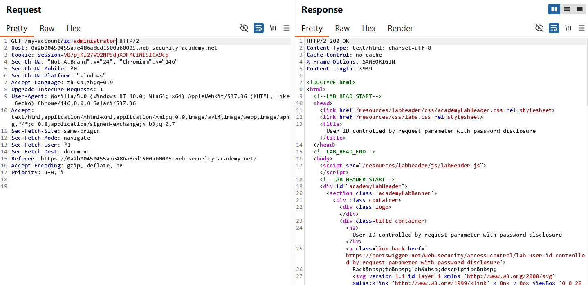
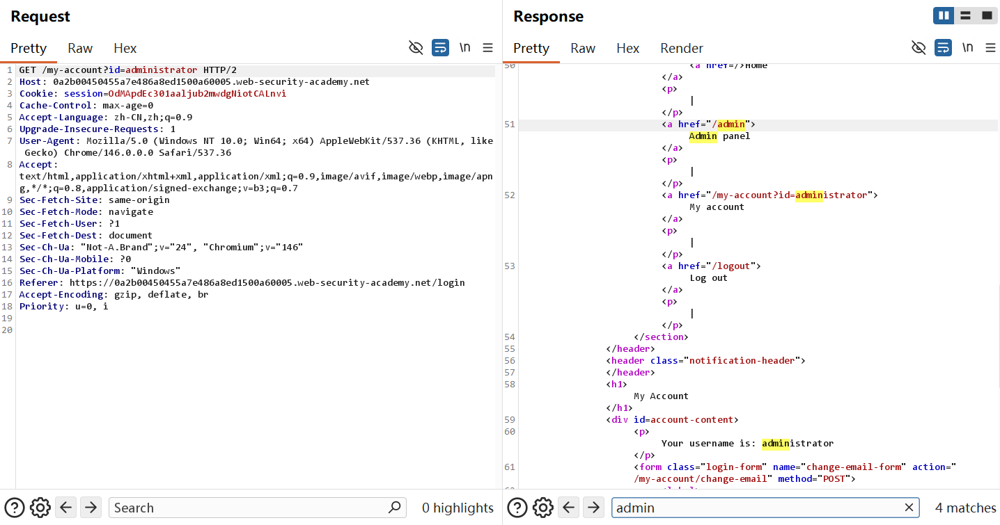
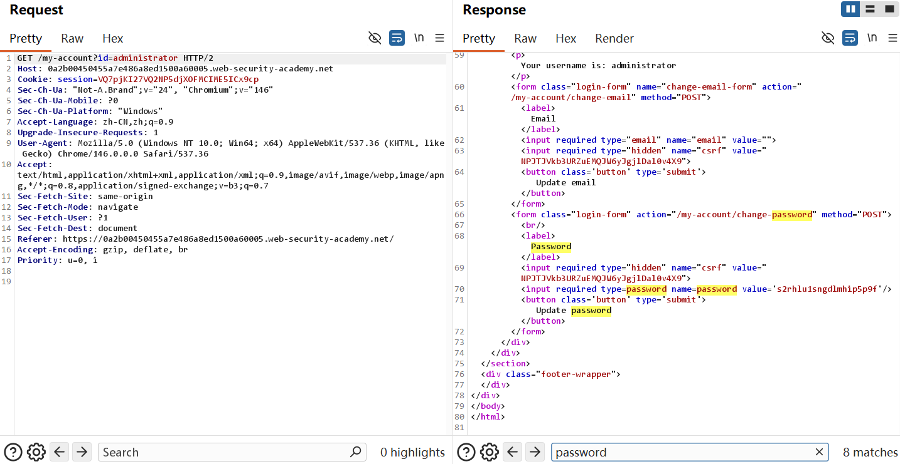
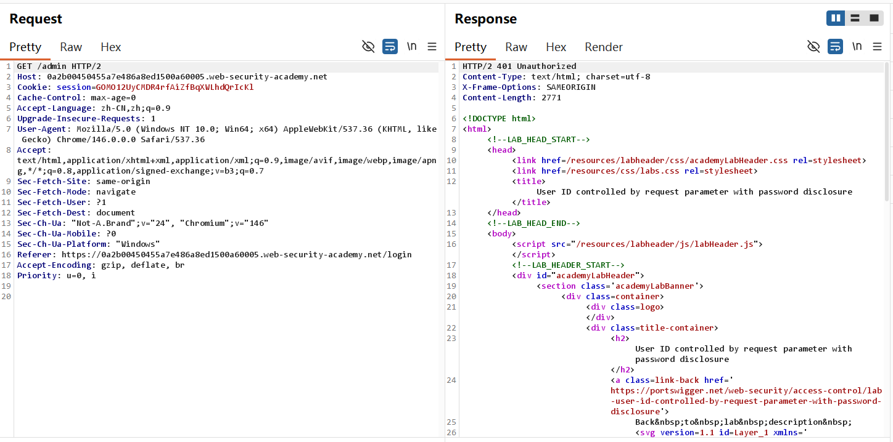
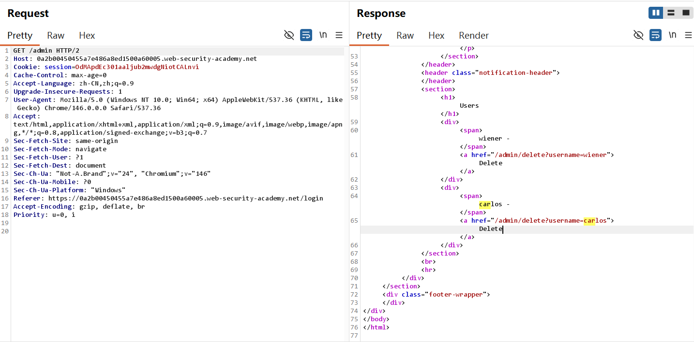
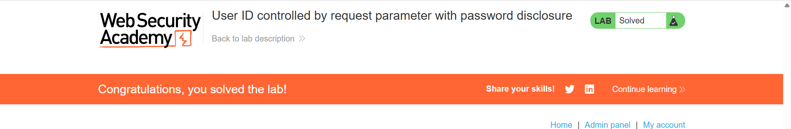

#  User ID controlled by request parameter with password disclosure-Burp 复现

## 实验信息

- 平台：PortSwigger Web Security Academy
- 漏洞：Access Control
- Lab:  User ID controlled by request parameter with password disclosure
- 难度：Apprentice

## 漏洞原理
该场景属于**Broken Access Control (访问控制失效)** ，原理是 Horizontal to vertical privilege escalation(越权访问)漏洞。核心原因是服务器端未对请求参数中的用户标识（User ID）进行严格的权限校验，仅通过前端传入的id参数判断用户身份，未验证当前登录用户是否有权限访问该id对应的资源。同时，系统将敏感信息（如管理员密码）直接嵌入前端页面代码中，未做任何加密或隐藏处理，导致普通用户可通过修改id参数，越权访问管理员账户信息，并获取明文密码，进而实现从普通用户到管理员的权限提升，最终破坏系统的机密性（Confidentiality）和完整性（Integrity）

Lab 6:

1. 在登录成功后直接进行越权将id改为administrator，可以看到status code is 200 ok


2. 在Response的frontend窗口可以看见敏感信息，包括admin panel的URL以及administrator password




3. 既然retrieve the URL /admin，试着能否直接进入控制面板破坏Integrity，发现这里是做了防护措施



4. 不过可以通过administrator password进行登录，这时可以Get /admin 进入控制面板将用户Carlos删掉


5.lab solved!



## 利用Payload

```http
Get /myaccount?id=administrator
```

将个人id改成管理员身份

```http
Get /admin
```

访问admin panel

这些都在之前的lab中得到充分的练习


## 个人总结

-  第一， 如何利用这个漏洞？

普通用户身份可以直接修改URL并通过前端页面获取管理员身份信息，越权访问并修改内部文件

- 第二，为什么会产生这个漏洞？

没有进行用户身份校验；把个人密码敏感信息直接prefilled in input box, 前端页面可以直接查看

- 第三，如何修复这个漏洞？

登录的用户身份校验authentication是必不可少的；密码不能明文暴露在前端。

​	至此，Access control类型的基础lab solved，可以发现很多的漏洞都是直接把个人信息放到前端，那么这不能保证Confidential，这些lab完成的条件都是将Carlos删除，Integrity也不能保障，administrator作为最高权限用户，在这些lab中身份验证的缺失就是导vulnerability的关键。