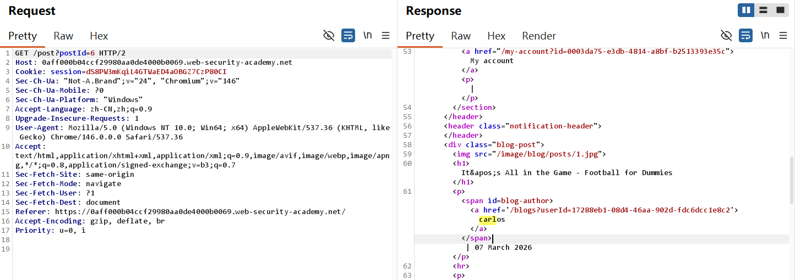
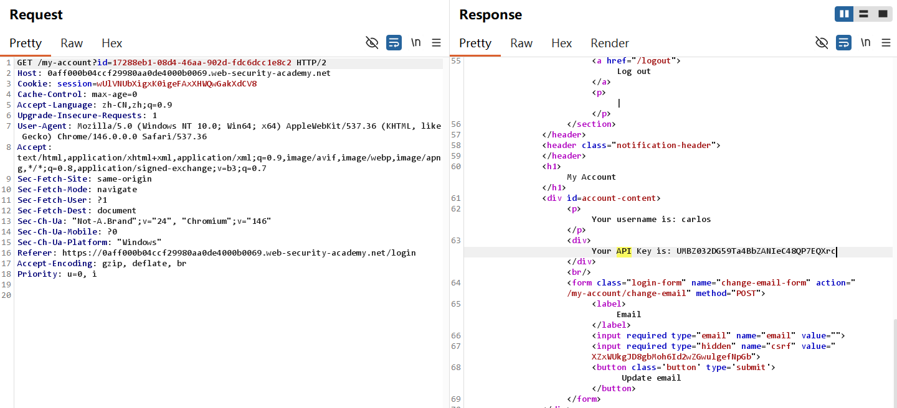
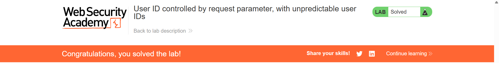

# User ID controlled by request parameter, with unpredictable user IDs -Burp 复现

## 实验信息

- 平台：PortSwigger Web Security Academy
- 漏洞：Access Control
- Lab: User ID controlled by request parameter, with unpredictable user IDs
- 难度：Apprentice

## 漏洞原理

该场景属于**Broken Access Control (访问控制失效)** ，原理是**基于请求参数的 ID 可控 + 敏感用户 ID 前端泄露**的Horizontal privilege escalation(越权访问)漏洞。核心原因是网站用户 ID 采用 GUIDs，本意防止攻击者暴力猜测 ID；但应用在博客、评论、留言等前端展示位置，直接明文暴露了其他用户的唯一身份 ID。攻击者无需猜解 ID，只需在页面抓取目标用户（Carlos）的公开 GUID，直接替换请求内的用户 ID 参数，服务端未做二次身份鉴权，最终导致横向越权，直接读取他人私密信息、API 数据。

## 测试过程

Lab 5:
1. 先看原文

"In some applications, the exploitable parameter does not have a predictable value. For example, instead of an incrementing number, an application might use globally unique identifiers (GUIDs) to identify users. This may prevent an attacker from guessing or predicting another user's identifier. However, the **GUIDs** belonging to other users **might be disclosed** elsewhere in the application where users are referenced, **such as user messages or reviews**." 也就是说我们可以通过页面的**Blog**或者**评论**找到目标对象Carlos，找到Carlos的发的blog，他的身份信息userId直接被展示在fronted页面

2.将他的id URL放进request，成功登录并找到API

3. 提交API, lab solved!

## 利用Payload

仅需要手动修改id参数，其余步骤直接放进Repeater并在Response页面查找对应API即可

## 个人总结

-  第一， 如何利用这个漏洞？

其他用户的个人信息直接被展示在前端，甚至可以绕过密码的校验就能直接登录获取API

- 第二，为什么会产生这个漏洞？

将敏感信息暴露在前端，破坏Confidential。在lab2里面直接将admin panel的放在JavaScript中，直接绕过登录一样，都是属于Access Control的漏洞

- 第三，如何修复这个漏洞？

后端严格校验当前登录用户与请求 ID 的一致性，杜绝Horizontal privilege escalation；

禁止在博客、评论、公开页面泄露用户唯一私密 ID、GUID 等核心身份标识；

所有读取个人私密数据的接口，必须依托后端会话鉴权，不信任前端传入的用户 ID 参数
