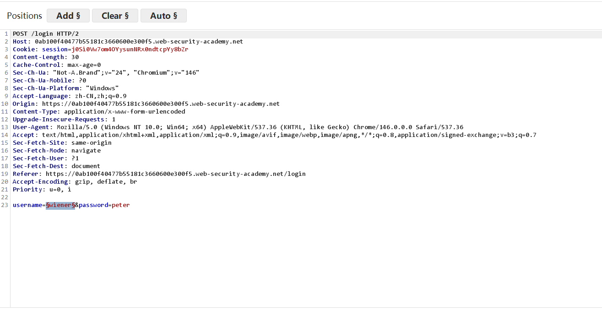
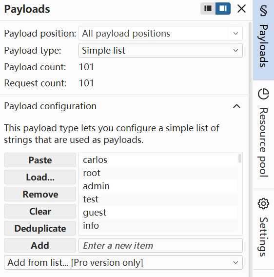
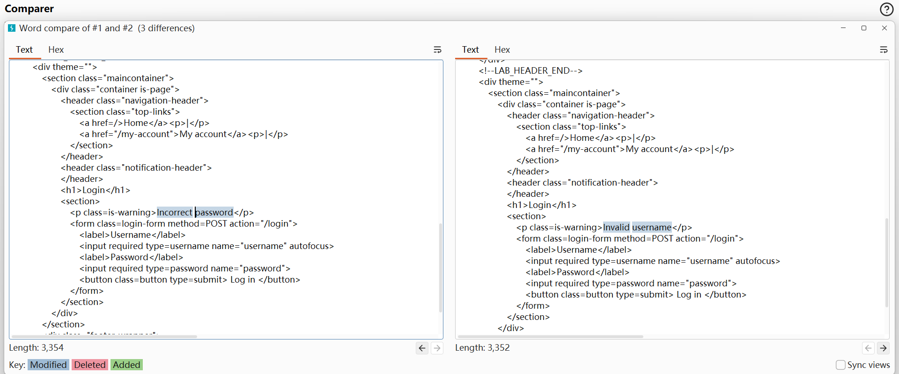
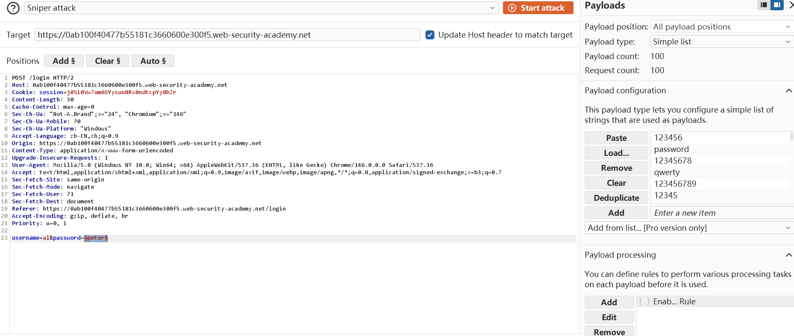
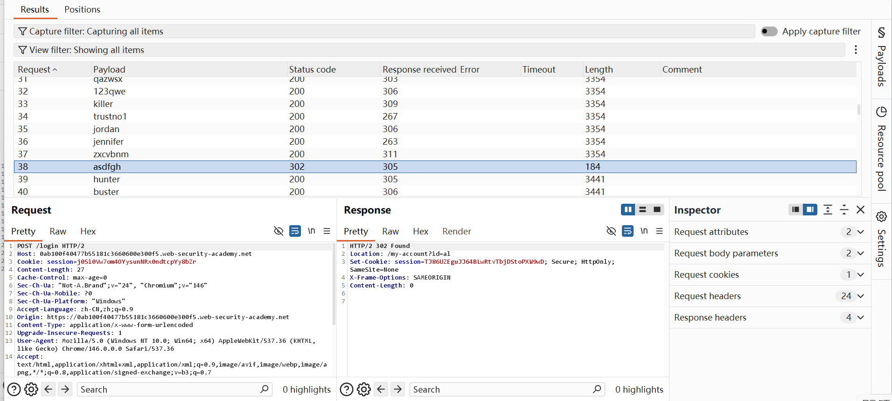
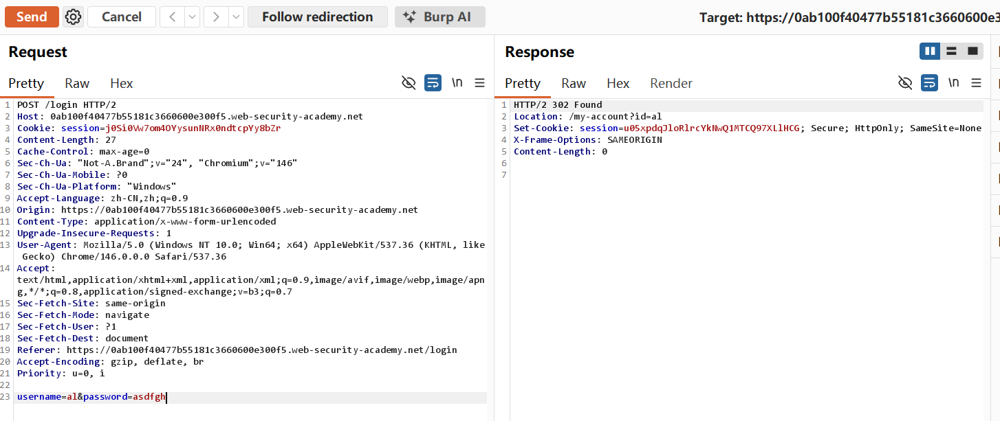

## Username enumeration via different responses -Burp复现

## 实验信息

- 平台：PortSwigger Web Security Academy
- 漏洞：Authentication
- Lab: Username enumeration via different responses
- 难度：Apprentice

## 漏洞原理

该漏洞属于Authentication下**Username Enumeration(用户名枚举漏洞)**，核心成因是 Web 应用在登录鉴权时，对「用户名不存在」和「用户名存在但密码错误」两种场景返回了差异化的响应信息。正常安全的登录设计，会统一返回模糊提示（如 “用户名或密码错误”），规避攻击者区分账号有效性；而本漏洞场景中，应用会精准反馈：无效用户名提示「Invalid username」，有效用户名但密码错误提示「Incorrect password」。攻击者可利用这种响应文案、数据包长度、状态码、页面返回内容的差异，配合爆破工具批量遍历用户名字典，精准筛选出系统内已注册的有效账号；拿到有效用户名后，再针对性对该账号进行密码爆破，大幅降低暴力破解的难度与工作量，为后续账号入侵铺路。

## 测试过程

Lab 7:
1. 给了Candidate usernames and passwords lists, 通过Burp Intruder进行enumeration(枚举) 。登录wiener账号，hiighlight wiener 右键发送到Intruder

2. 在右边的payload configuration粘贴给定的username list开始爆破攻击

3. 可以在结果中发现很多结果相同，但是有一个特殊的用户名的length不同，利用Burp comparer窗口和其他结果的前端界面对比，其他内容为Invalid username, 只有al显示为Incorrect password可以确定，al就是目标用户

4. 和username的enumeration操作一样，highlight the peter(给定的password)，paste passwords we copied from the list开始攻击

5. 同样有一个unusual length，发现他的status code is 302 Found ,这就是我们的目标密码

6. 成功登录

7. lab solved!

## 利用Payload

通过Burp Intruder的右侧Payload可以进行枚举爆破，降低手动列举的工程量。如果会一点点编程的话，在拥有用户名和密码的情况下，写一个自动化脚本也可以实现，不过这里是apprentice learning，重点在于Burp工具的使用，几个月后将会开始practitioner learning同样会有authentication vulnerability，就不局限于Burp工具的使用与复现，采用多种形式解题，并将源代码同步到[Github]([Naclarb/web-security-learning: PortSwigger Labs and Burp Suite Practices](https://github.com/Naclarb/web-security-learning))

## 个人总结

-  第一， 如何利用这个漏洞？

暴力破解是最简单粗暴的方式，只要attacker拥有valid username，结合现代化工具以及对密码的预测，例如：大部分用户的各个平台密码几乎一致，仅有微小改变，如果只要一个平台发生泄漏将会导致用户全生态的泄露。

- 第二，为什么会产生这个漏洞？

显然，只要其他用户得到目标用户的账号和密码就能登录，而不进行authentication就是漏洞来源。以Google的登录系统为例，可不仅仅是账号密码就可以login, 还需要图片验证码(九宫格找出所有的Car)证明不是机器人以及短信/邮箱验证码来证明是本人。

- 第三，如何修复这个漏洞？

参考google的登录，加入图片验证码和短信验证码，authentication；(在下一个lab中会看到有关验证码的漏洞，请持续关注更新)

参考手机的开锁，超过一定次数将会锁定，防止枚举