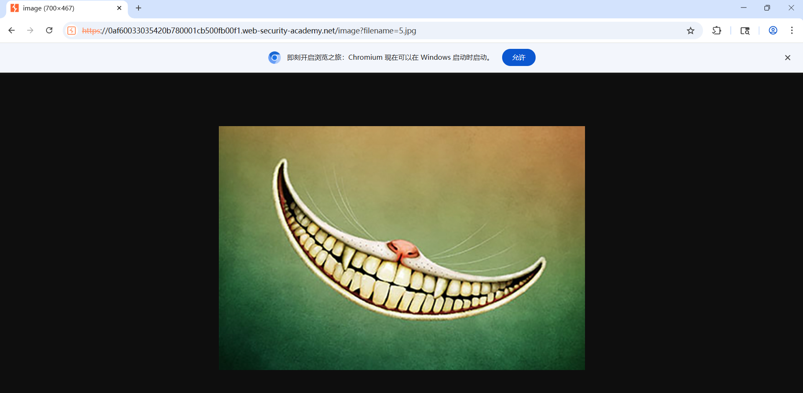
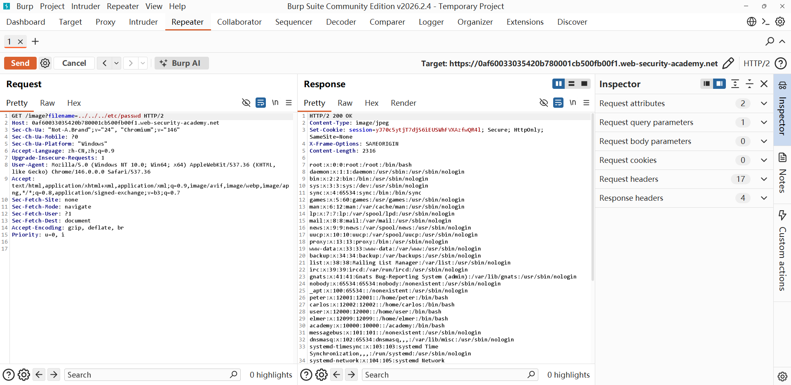
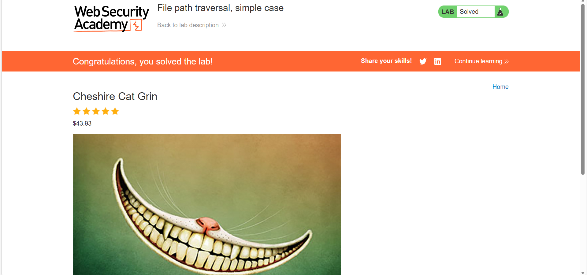

# File path traversal, simple case

## 实验信息

- 平台：PortSwigger Web Security Academy
- 漏洞：路径遍历漏洞（Path Traversal）
- Lab:[Server-side vulnerabilities - PortSwigger](https://portswigger.net/web-security/learning-paths/server-side-vulnerabilities-apprentice/path-traversal-apprentice/file-path-traversal/lab-simple#)
- 难度：简单

## 漏洞原理

网站通过 `filename` 参数直接读取图片，未对用户输入做任何过滤，攻击者可通过 `../` 向上跳转目录，读取服务器上的敏感文件（如 `/etc/passwd`）。

## 测试过程

1. 访问实验环境，点击商品图片，在 Burp Suite 中抓包获取图片加载请求： 
2. 将该请求右键发送至 Burp Suite 的 Repeater 模块： 
3. 修改 `filename` 参数为路径遍历 payload，构造恶意请求： 
4. 发送请求后成功读取 `/etc/passwd` 文件，实验显示 `Lab solved!`： 

## 利用 Payload

```http
../../../etc/passwd
```

## 个人总结

通过本次实验，我理解了最基础的路径遍历（Path Traversal）漏洞原理，认识到 `../` 目录跳转符在实际开发中必须严格过滤。后续会继续练习 Access control（访问控制）相关的基础实验，巩固服务器端漏洞的学习。
