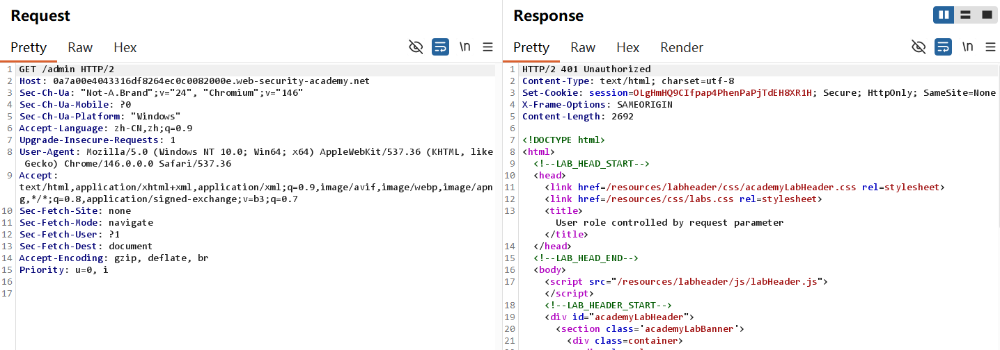
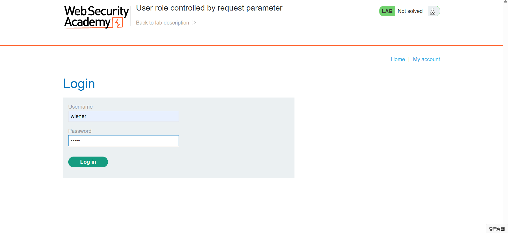
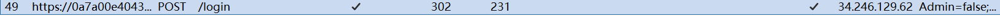
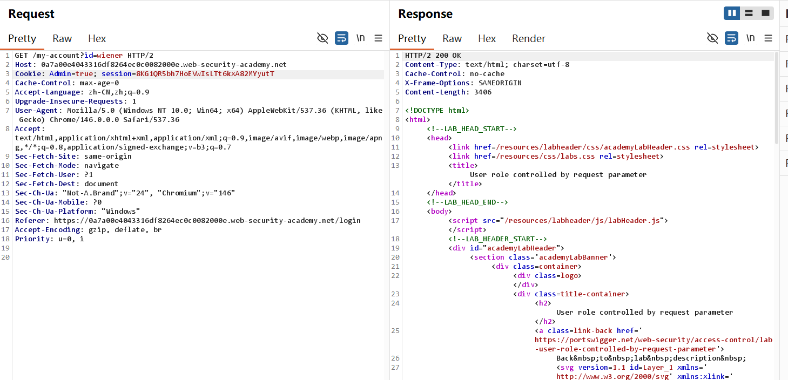
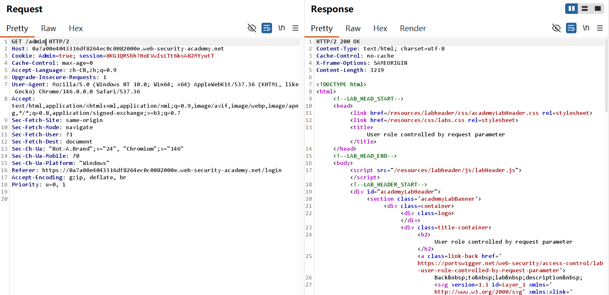
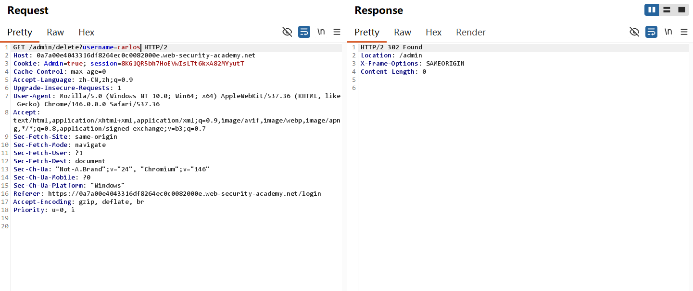
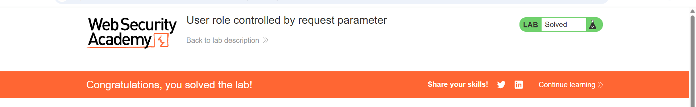
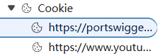

# User role controlled by request parameter-Burp 复现

## 实验信息

- 平台：PortSwigger Web Security Academy
- 漏洞：Access Control 
- Lab: User role controlled by request parameter
- 难度：Apprentice

## 漏洞原理

该漏洞属于**Broken Access Control (访问控制失效)**，原理是客户端可控权限参数 + 服务端鉴权缺失，核心原因是网站将管理员权限标识直接明文存放于 Cookie 中，完全依赖前端参数判定用户身份，未在服务端对高权限操作做二次身份校验与权限拦截。同时关键权限参数暴露在客户端可篡改的请求数据里，攻击者可随意修改 Cookie 内 admin 字段值伪造管理员身份，直接绕过访问控制限制，未经授权访问后台管理路径并执行删除用户等高敏感操作。

## 测试过程

Lab 4:
1. /admin这个URL路径已经很熟悉了,试着直接添加会发生什么


2. 结果发现401(Unauthorized需要身份验证才可以访问资源)好在这个lab给定了账号和密码，可以登录



3. 在Burp的HTTP history可以抓包，这里的cookie显示Admin = false



4. 那么直接修改admin的参数，把他改成true (By the way,我们如果是在浏览器进行修改cookie可以通过F12的应用程序部分找到Cookie也可以修改) 这时和step1不一样，status code 200 ok




5. 删除过程还是和以往一样，不多赘述



6. Solved!




## 利用Payload

```http
admin=true
```

这里只需要修改cookie的admin参数值就可以完成，后续的删除和前面的lab流程一样


## 个人总结

-  第一， 如何利用这个漏洞？

所有网站的cookie普通用户都能直接访问，只要在cookie中找到admin并修改成true值就可以获得管理员权限，显然破坏了Confidential，我可以随便删除内部文件，这对一个企业带来的危害是十分严重的。

- 第二，为什么会产生这个漏洞？

Cookie上直接就有admin的值，任何人都可以随意修改，获得更高权限在现实肯定是不合理的。就以这个网站为例(Not the lab)，他也没有把admin直接放到cookie里。



- 第三，如何修复这个漏洞？

权限标识严禁明文存客户端 Cookie；管理员权限只在后端 Session / 数据库校验；所有敏感接口（删除用户、后台管理）必须服务端二次鉴权，拒绝前端传过来的权限参数。
