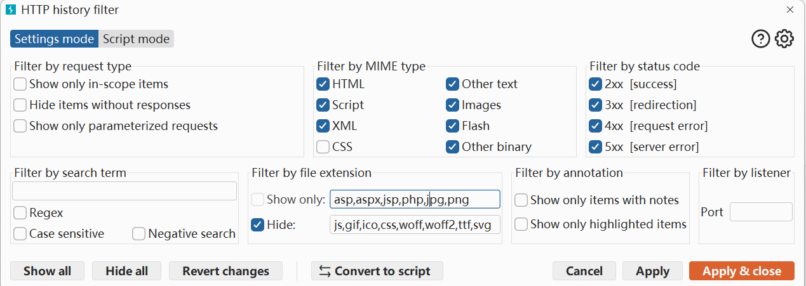
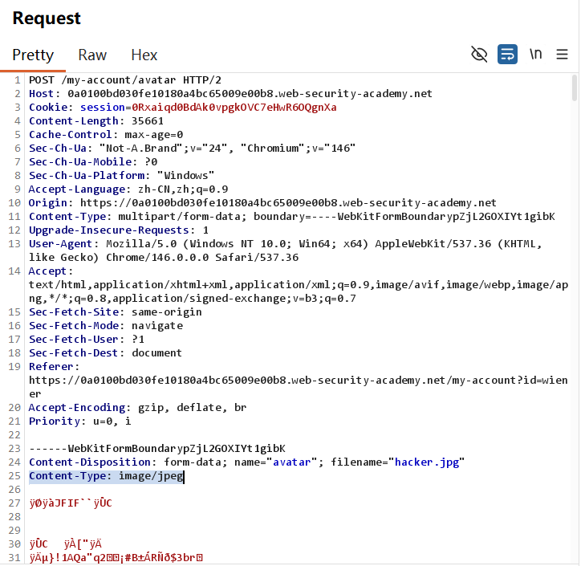
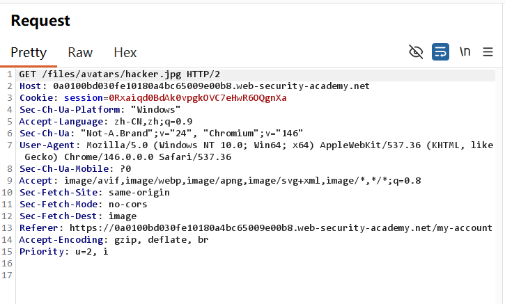
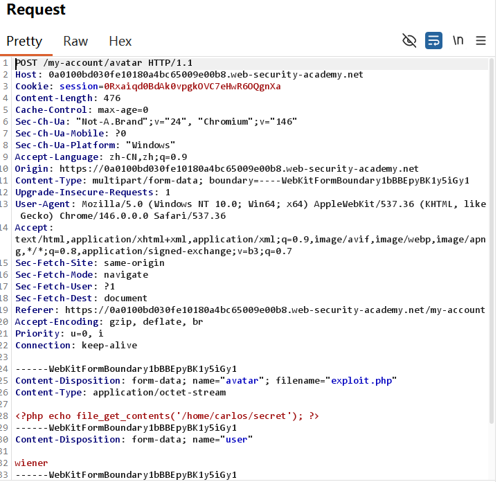
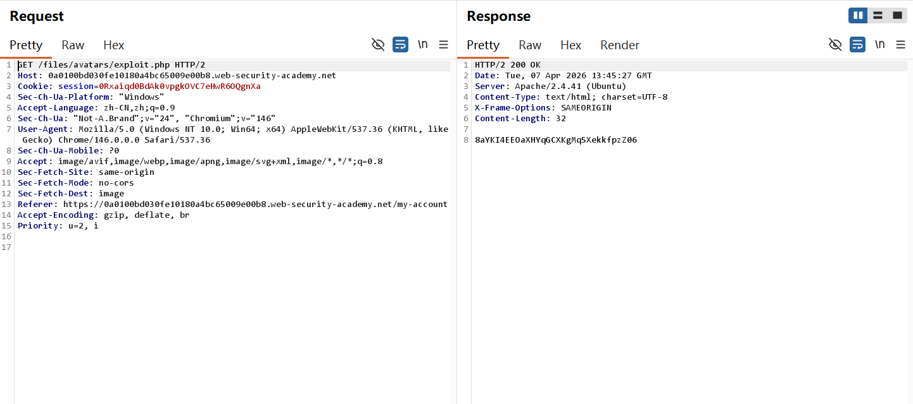
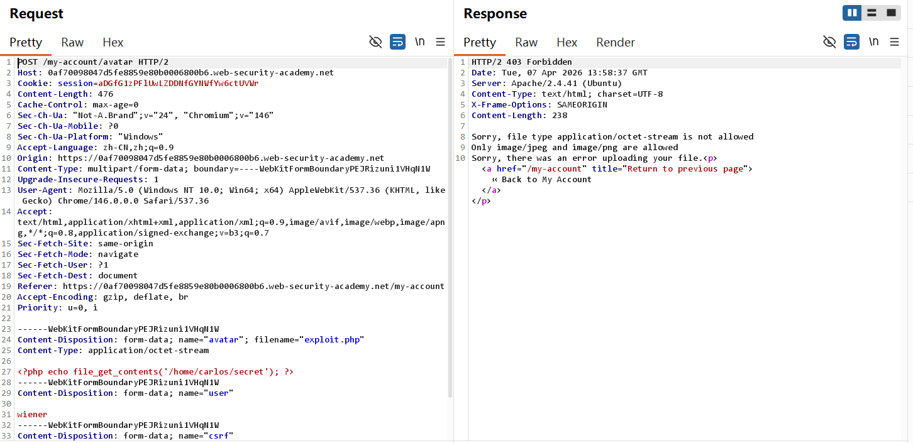
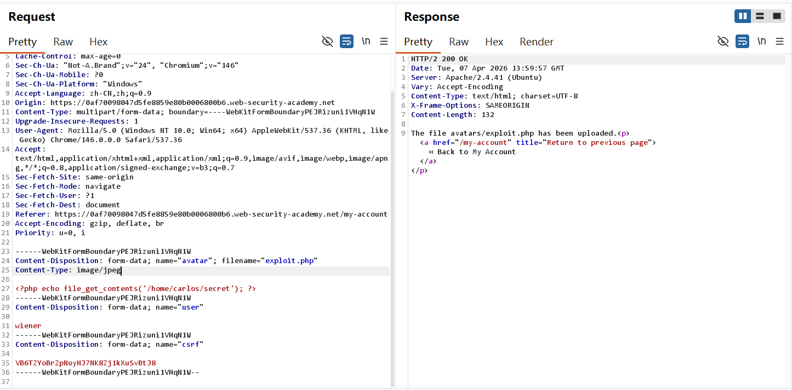
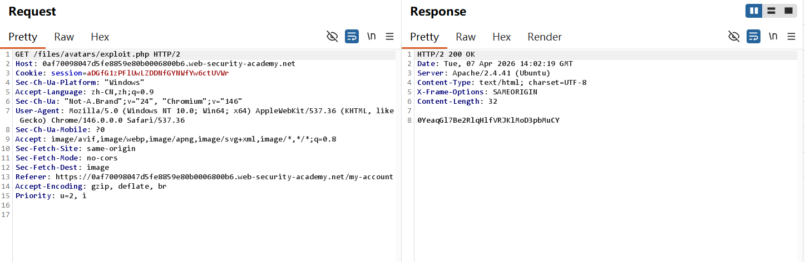

## Remote code execution via web shell upload&Web shell upload via Content-Type restriction bypass-Burp 复现

## 实验信息

- 平台：PortSwigger Web Security Academy
- 漏洞：File upload vulnerabilities
- Lab: Remote code execution via web shell upload&Web shell upload via Content-Type restriction bypass
- 难度：Apprentice

## 漏洞原理

漏洞属于File upload vulnerabilities，核心成因是网站没有对用户上传的文件进行校验。攻击者可以通过直接上传恶意文件或篡改content-type该header的参数，让服务器执行恶意文件内部代码，读取、泄露敏感信息


## 测试过程

Lab 11:
1. 为了观察正常上传图片和上传php的区别，将jpg, png从hide中剪切到show only,并tick images所在的check box 


2. 在登录页面login后，上传普通图片作为头像，可以看到content-type是jpeg形式


3. 此时，filter没有在http history将get jpg的URL过滤掉，可以看到URL有第二步上传的图片名


4. 在头像上传页面上传php文件


5. 可以在http history找到get php的request, send后可以看到Response200ok, 成功获得Carlos's secret


Lab 12:
1. 在有了lab11的经验后，首先尝试upload php file,发现文件名不匹配，只能上传jpg,png格式


2. 在request的content-type这个header处将原本内容修改为jpeg


3. 在http history处找到Get伪装成图片的php文件的request，send后成功得到Carlos's secret


4. lab solved！


## 利用Payload

```php
<?php echo file_get_contents('/home/carlos/secret'); ?>
```

通过file_get_contents并给定路径就能访问内容

## 个人总结

-  第一， 如何利用这个漏洞？

lab11对文件格式完全没有拦截，因此可以向内部上传 Web 脚本实现代码执行，甚至窃取内部信息。lab12虽限定只能上传特定图片格式，但是同样可以直接进行content-type的修改以上传恶意代码。

-  第二，为什么会产生这个漏洞？

lab11出现该漏洞是因为没有对文件内容进行任何防御，lab12没有校验文件内容是否真是图片内容。


- 第三，如何修复这个漏洞？

不能只靠 Content-Type 校验，必须后端白名单校验后缀 + 检查文件内容，防止attacker将恶意文件伪装为可上传文件