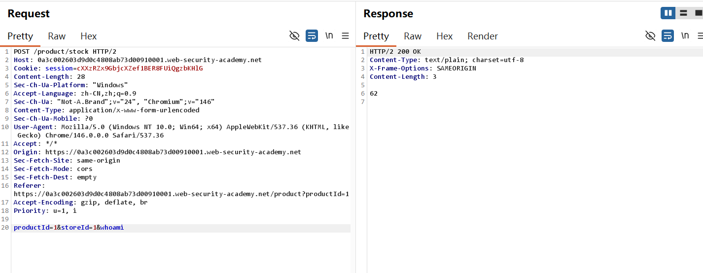
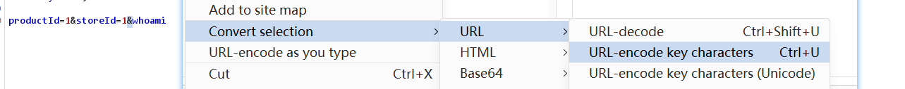

## OS command injection-Burp 复现

## 实验信息

- 平台：PortSwigger Web Security Academy
- 漏洞：OS command injection
- Lab:  OS command injection, simple case
- 难度：Apprentice

## 漏洞原理

该漏洞属于OS command injection(OS命令注入漏洞)，核心成因是用户输入与系统命令未隔离，输入内容被OS当成合法命令执行。攻击者可拼接恶意系统命令，获取服务器信息及权限，甚至控制服务器。


## 测试过程

Lab 13:
1. 在库存页面将storeID参数加上whoami(OS常用命令)，post发现Response并没有展示用户名


2. 将&改成ASCII码，将会把&当成分隔符并执行whoami指令


3. 成功获得用户路径
.png)

4. 也可以根据linux的基础知识，可以在原有指令上加上| whoami，成功获得用户名
.png)

5. Lab solved

## 利用Payload

```http
productId=1&storeId=1|whoami
```

```http
productId=1&storeId=1%26whoami
```

## 个人总结

-  第一， 如何利用这个漏洞？

在用户可输入参数中拼接系统命令分隔符(|,&等)，注入whoami等系统命令，让服务器执行并返回执行结果，可以实现信息泄露，权限获取

-  第二，为什么会产生这个漏洞？

web后端未将用户可控参数进行过滤，导致separator被正常解析，恶意注入命令被执行


- 第三，如何修复这个漏洞？

先URL decoding, 再过滤危险字符。将特殊命令字符转义，或直接禁止输入这类特殊字符。