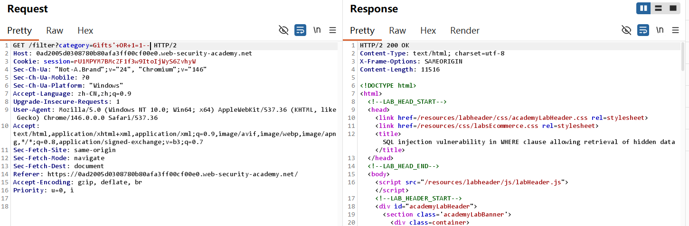
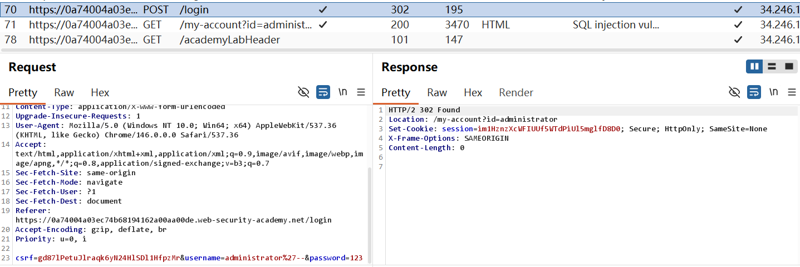
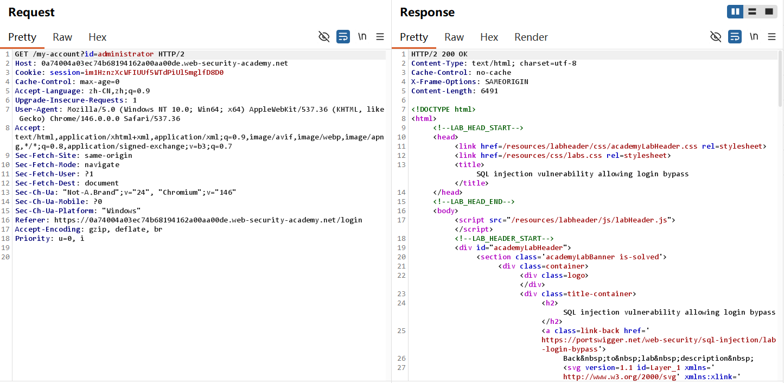

## SQL injection-Burp 复现

## 实验信息

- 平台：PortSwigger Web Security Academy
- 漏洞：SQL injection
- Lab:  SQL injection vulnerability in WHERE clause allowing retrieval of hidden data&SQL injection vulnerability allowing login bypass
- 难度：Apprentice

## 漏洞原理

该漏洞属于 SQL injection（SQL 注入），核心成因是**Web 应用直接将用户可控输入未经安全处理，拼接进 SQL 查询语句**，导致攻击者可以构造恶意 SQL 片段，改变原有查询逻辑。攻击者可以通过注入恒真条件、注释后续语句等方式，绕过权限校验、查询隐藏数据，甚至实现数据窃取、篡改、删库等危害。


## 测试过程

Lab 14:
1. 根据Mysql基础知识，--是注释符号，将released = 1的内容注释掉，即可查看所有商品信息。此时后端sql将会是

```mysql
select * from products where category = 'Gift' or 1 = 1 -- released = 1
```
1=1为真，所以会select all


2. lab solved


Lab 15:
1. 登录administrator账号，密码未知，将用户名改为administrator'-- 后端sql将会是

```mysql
select * from users where username = 'administrator'--' AND password = '123'
```
将会把' AND password = '123'部分注释，即可访问administrator。在burp上会发现'被encoded为%27



2. 成功登录administrator


3. lab solved!


## 利用Payload

```http
category=Gifts'+OR+1=1--
```

```http
administrator'--
```

## 个人总结

-  第一， 如何利用这个漏洞？

在用户可控参数中构造恶意 SQL 片段，使用单引号 `'` 闭合原有引号，拼接 `OR 1=1` 这类恒真条件，并用 `--` 或 `#` 注释掉后续 SQL 语句，从而查询全部数据、绕过登录验证，实现未授权访问。

-  第二，为什么会产生这个漏洞？

应用后端直接将用户输入拼接到 SQL 语句中，**没有对单引号、注释符、关键字等危险字符做过滤或转义**，也没有使用预编译语句，导致用户输入被当作 SQL 语法的一部分执行，改变查询逻辑。


- 第三，如何修复这个漏洞？

对用户输入进行严格校验，使用白名单限制输入内容

对单引号、双引号等特殊字符进行转义处理