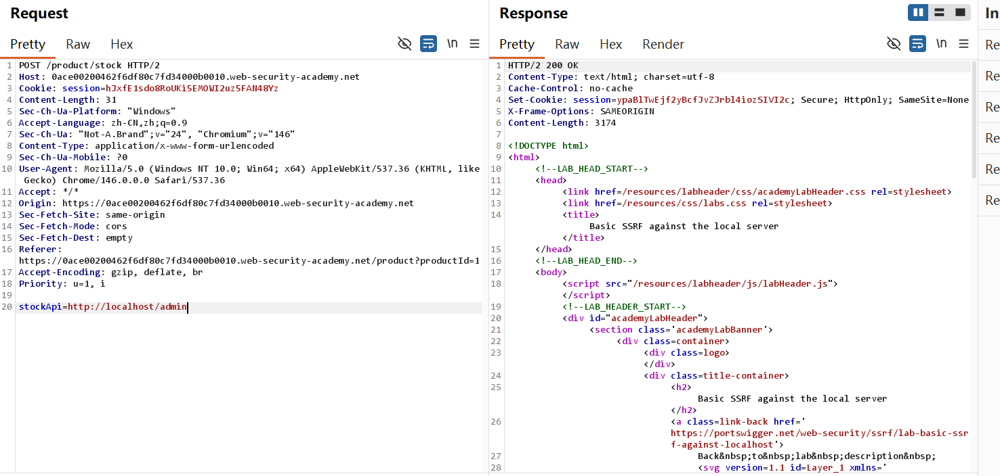
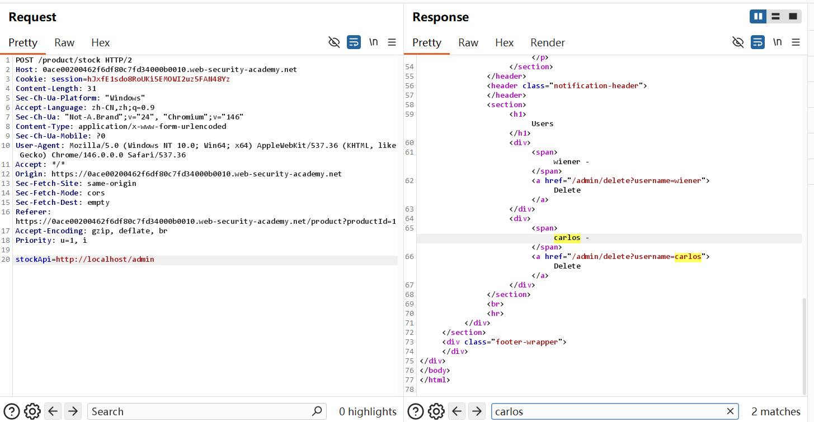
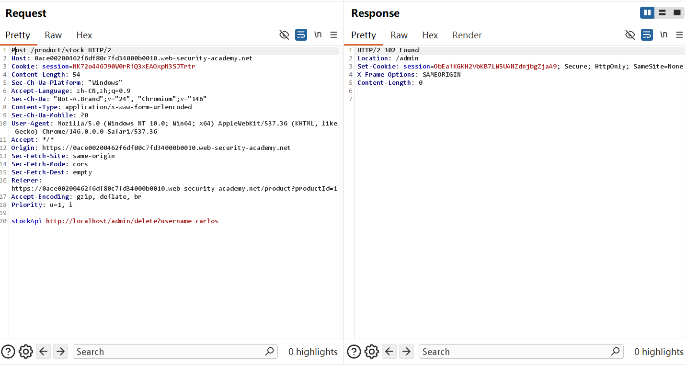
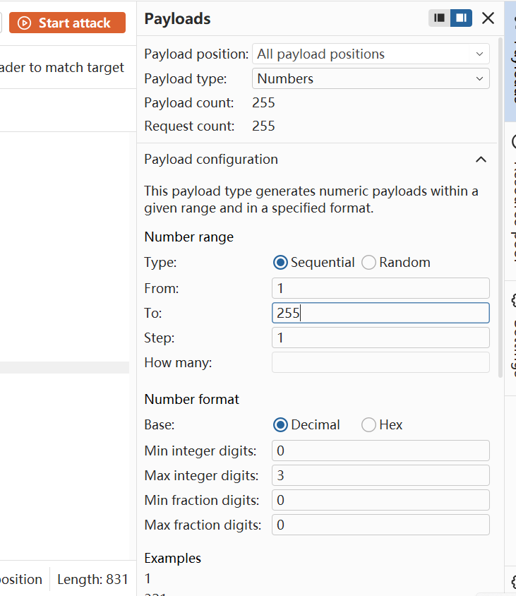
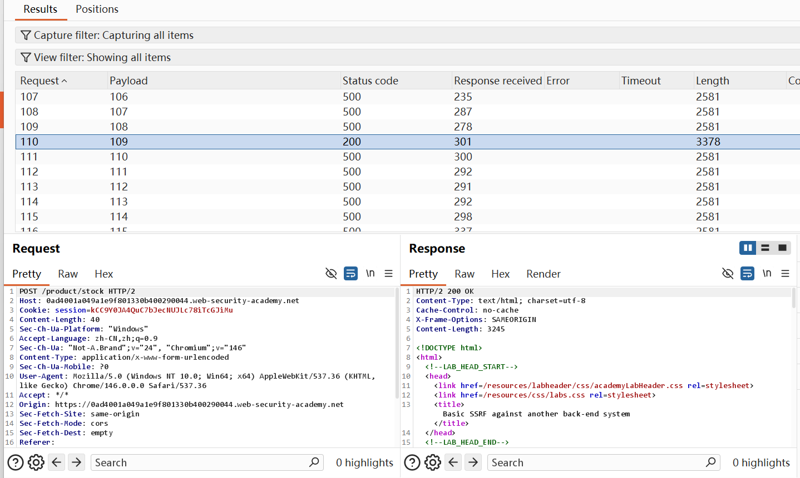
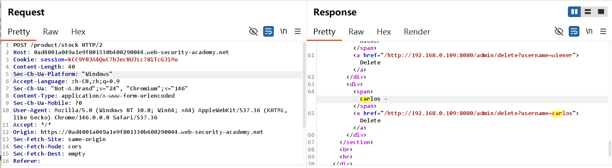
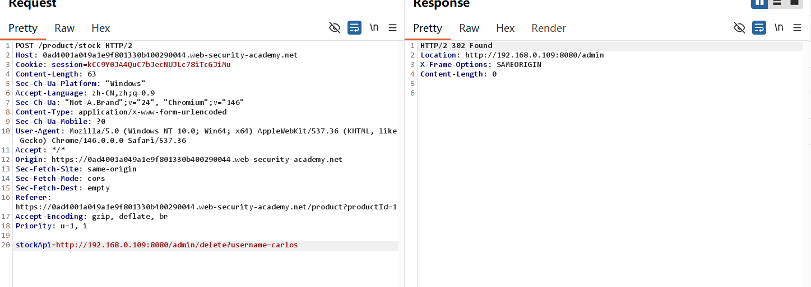

##  Basic SSRF against the local server& Basic SSRF against another back-end system-Burp 复现

## 实验信息

- 平台：PortSwigger Web Security Academy
- 漏洞：Serve- side request forgery(SSRF)
- Lab:  Basic SSRF against the local server& Basic SSRF against another back-end system
- 难度：Apprentice

## 漏洞原理

该漏洞属于SSRF(服务器请求伪造)，核心成因是Web应用直接接收用户的URL参数，没有对域名进行拦截和校验。攻击者可以通过篡改该参数，让服务器访问本地（localhost）或内网后端系统的敏感接口，执行破坏操作。


## 测试过程

Lab 9:
1. 访问商品页面，检查库存
    
2. 在Burp种观察Request，将stockApi后的URL修改成http://localhost/admin
    

3. 直接在Response前端页面找到删除carlos的URL,添加在stockApi=http://localhost/admin 后面，成功删除302
    
    
4. lab solved!
    

Lab10 :

1. 根据[lab7](portswigger-labs/server-side-vulnerabilities/lab7-Username enumeration via different responses.md)学习到的Brute-forcing, 可以直接将192.168.0.X最后的octet进行枚举，仅需要highlight最后一个octet 将1-255paste进payload(type simple list)
   不同于之前的用户名和密码，这需要自己从其他地方获得1-255列表， 手动是很慢的，可以使用编程写入文件的方式从txt复制，这里推荐linux 指令

```bash
seq 1 255 > num.txt
```

也可以highlight整个地址进行爆破，可供paste的linux指令为

```bash
seq 1 255 | xargs -I {} echo 192.168.0.{} > ip_list.txt
```

Burp的intruder右侧的payload type如果改成Numbers，可以直接Range from 1 to 255,无需手动paste



2. start attacking, 观察length得到正确的octet 200 ok
   

3. 通过Response找到删除carlos对应的URL
   

4. 成功删除Carlos
   

5. lab solved!
   
## 利用Payload

```http
http://localhost/admin
```
```http
stockApi=http://192.168.0.109(要通过爆破得出):8080
```
删Carlos的具体payload已熟练，且明文展示在Response页面无需强行记忆

## 个人总结

-  第一， 如何利用这个漏洞？

找到用户可控，能传入URL地址的参数，如stockApi,篡改参数直接访问本地后台，对于未知的octet可以直接brute-forcing，找到正确的URL进行管理员操作

-  第二，为什么会产生这个漏洞？

校验只防外部用户，SSRF是本地请求本地，可以bypass校验；为了应急修复，the application might allow administrative access without logging in


- 第三，如何修复这个漏洞？

直接拦截内网(localhost, 192.168)请求，增加administrator身份验证
