##  SQL injection UNION attack -Burp 复现

## 实验信息

- 平台：PortSwigger Web Security Academy

- 漏洞：SQL injection

- Lab:   

  SQL injection UNION attack, retrieving data from other tables

  SQL injection UNION attack, retrieving multiple values in a single column

  SQL injection attack, querying the database type and version on MySQL and Microsoft

  SQL injection attack, listing the database contents on non-Oracle databases

- 难度：practitioner

## 漏洞原理
该漏洞属于**SQL injection中的union attack**。 原理是：当Web应用将用户输入直接拼接到SQL查询中，且未使用参数化查询时，攻击者可以利用union select关键字将额外的恶意查询结果附加到原始查询结果之后。进行union注入需要满足两个条件1.返回相同数量的列，2.数据类型必须兼容。

## 测试过程

Lab 3: SQL injection UNION attack, retrieving data from other tables

1. 根据前面lab的所学内容，通过select null方法得到有效列数,'a'替换null,得到有效列均为字符型
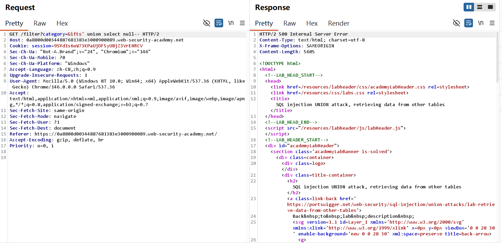
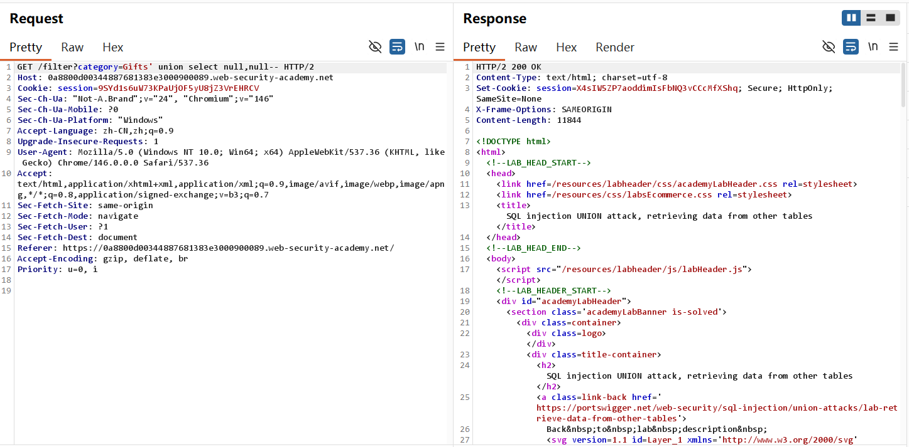

2. 注入payload: ' union select username,password from users-- . 得到管理员用户名及密码，在登录页输入密码，lab solved!
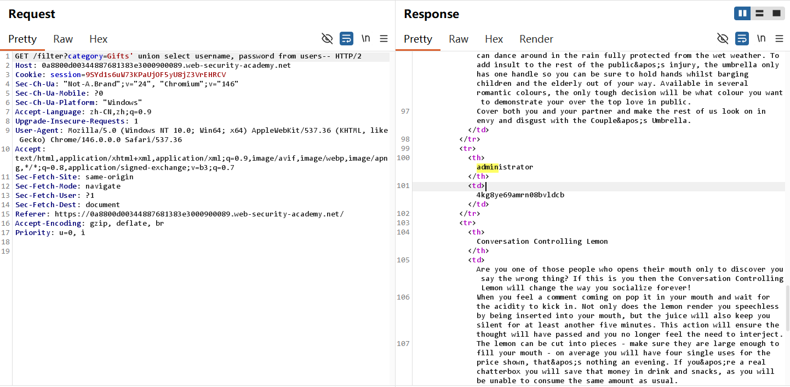
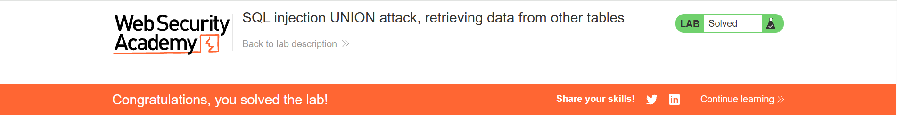

Lab 4: SQL injection UNION attack, retrieving multiple values in a single column
1. 使用select null确定有效列2列，第2列为字符串列

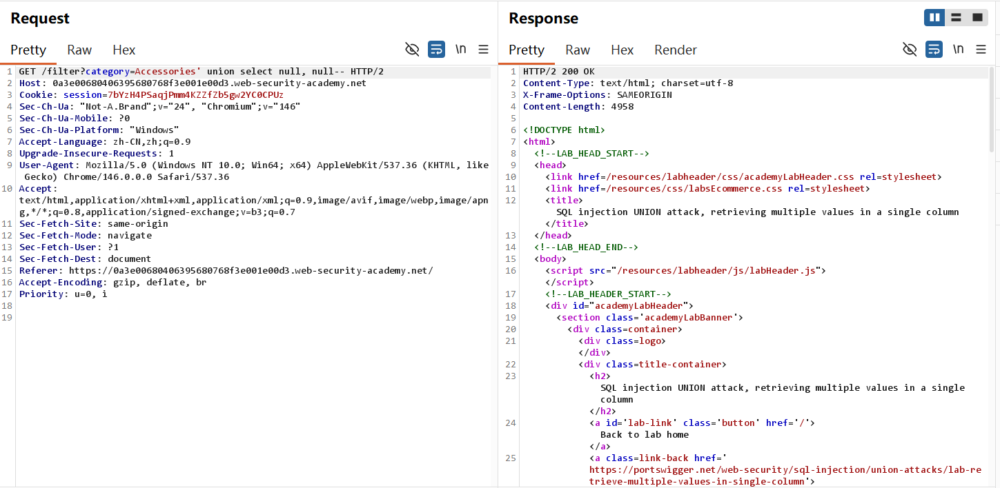
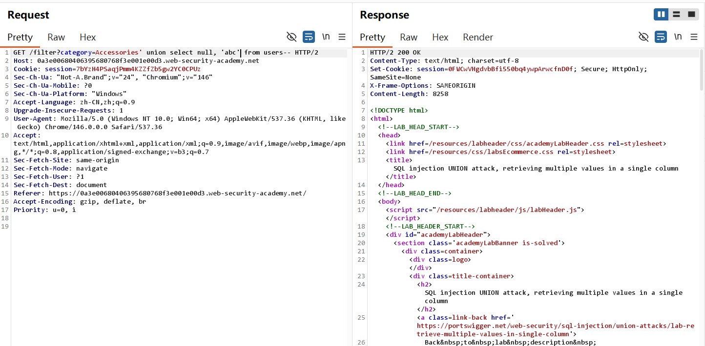

2. 不同于上一个lab，只有1列为字符串列，按照lab 3的payload无法获取有效信息。可使用使用||来将username和password连起来，(中间的~方便观察和复制用户信息) 将两列信息直接连接成一列字符串列
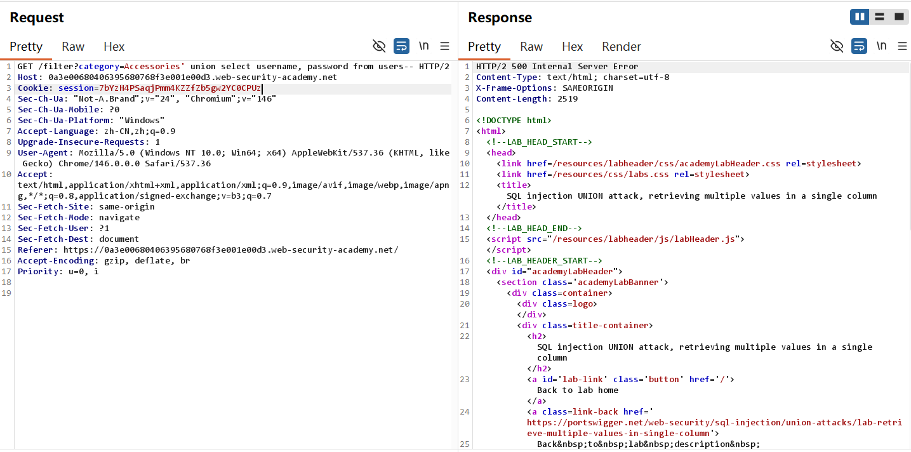
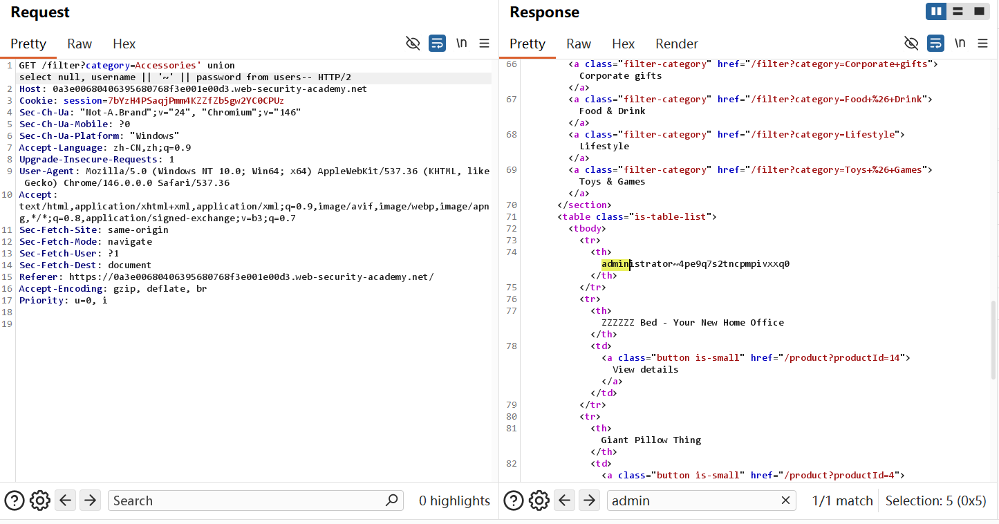
3. lab solved!
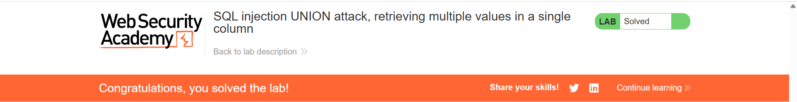

Lab 5: SQL injection attack, querying the database type and version on MySQL and Microsoft

1. 确定列数及各列数据类型(根据sql cheat sheet中展示的Mysql的注释要求在-后接空格，而其他数据库并不需要，接+即空格以兼容mysql数据库)
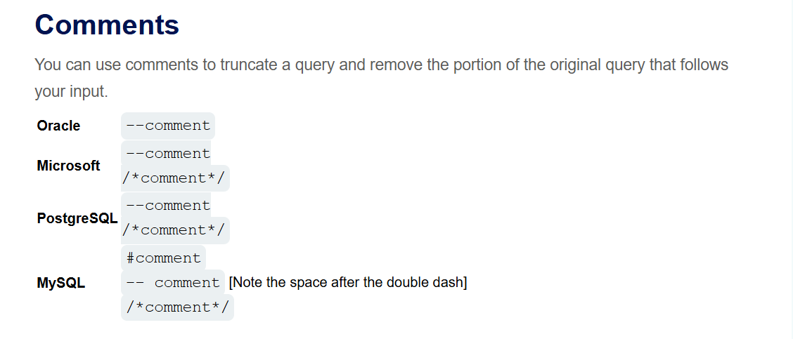
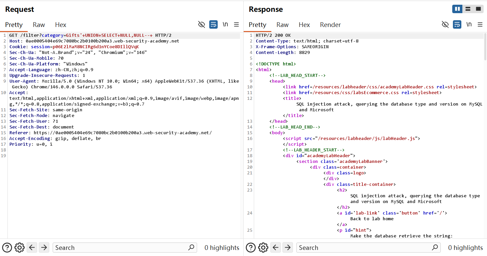
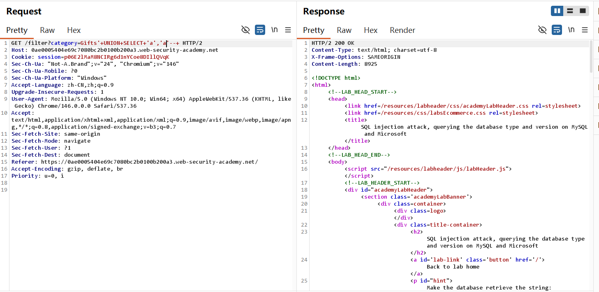
2. 任意选择一列，注入payload: union select null, @@version-- 判断数据库系统类型，成功获得数据库为mysql 8.0
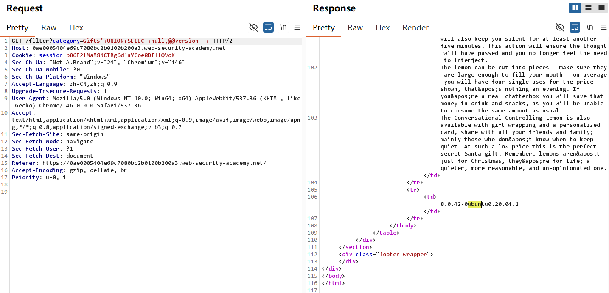


Lab 6: SQL injection attack, listing the database contents on non-Oracle databases
1. 按照select null方法得到table中的列数及数据类型，这里不再演示。注入payload获得表名(payload同样可以从cheat sheet中获取), 找到用户表的具体名
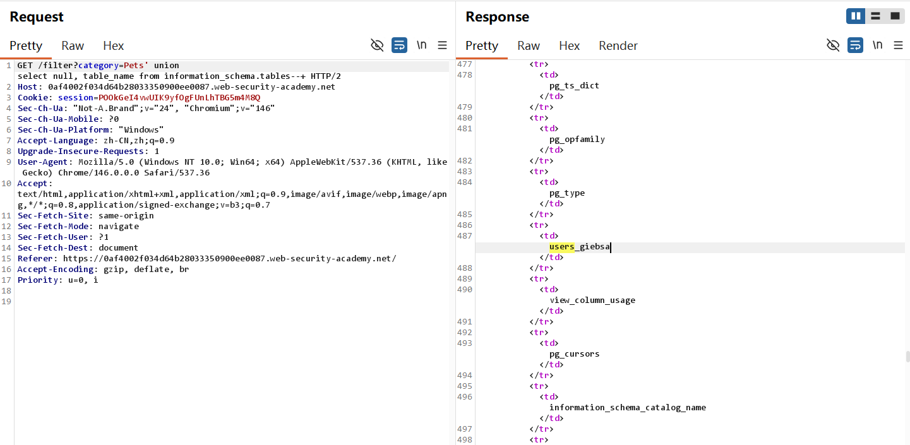
2. 注入payload获取username和password列的具体名称
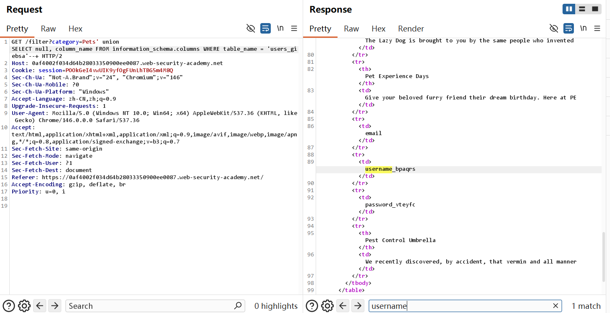
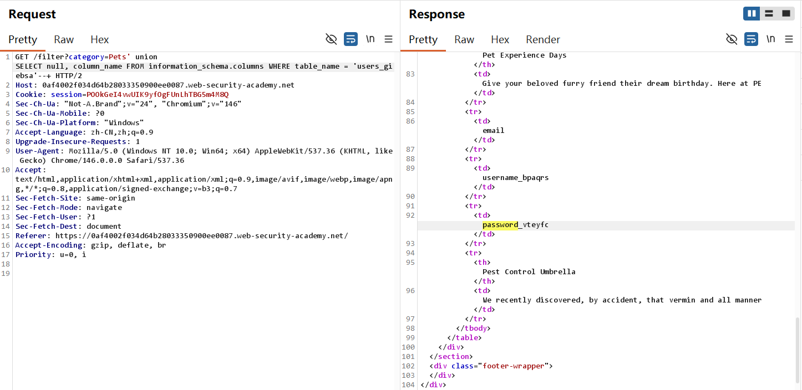
3. 根据sql学习过的基础查语句，直接获取各用户名及密码，成功找到管理员用户身份信息
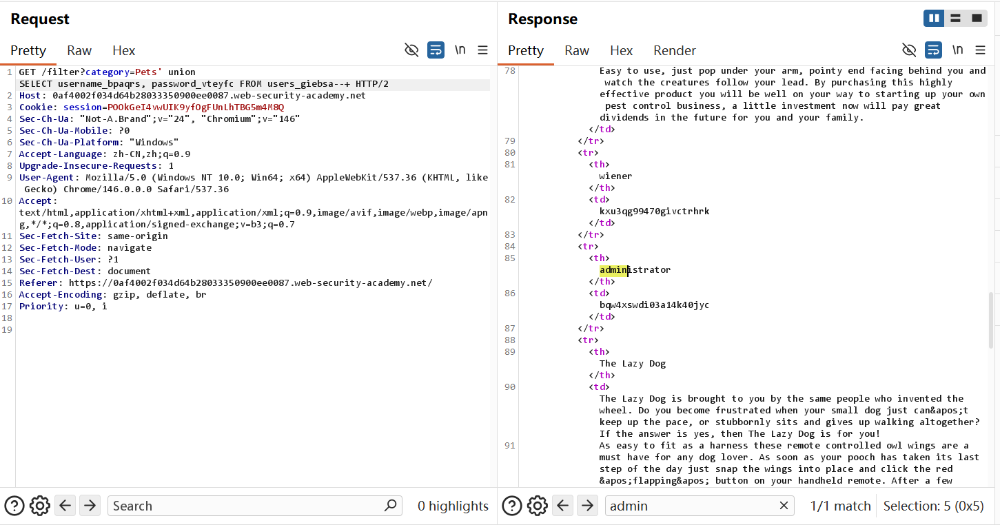
4. 也可以通过concat函数(各数据库通用)，将用户名和密码在一列中展示方便查看,lab solved!（不是oracle数据库，||无法正常使用）
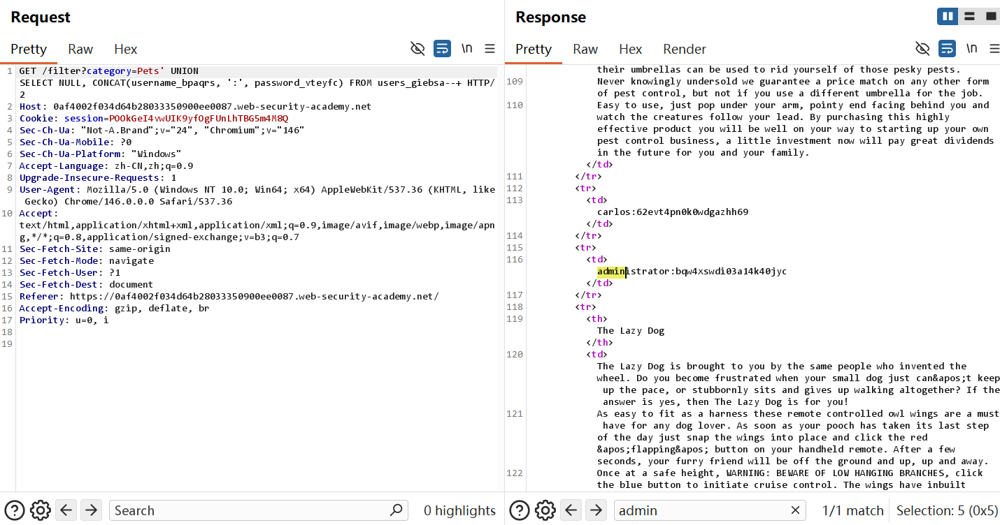
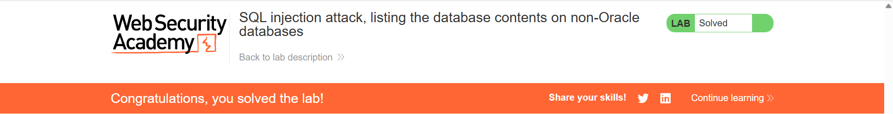

## 利用Payload

Lab 3: 两列有效列获取登录信息

```sql
' union select username, password from users-- 
```

Lab 4: 一列有效列获取登录信息

```sql
' union select null, username || "~" || password from users-- 
```

Lab 5: 获取数据库类型

```sql
' union select null, @@version from users--+
```

Lab 6: 枚举表名，一列获取身份认证信息

```sql
' union select null, table_name from information_schema_tables--+
select null, concat(username, ":", password) from users
```


## 个人总结

-  第一， 如何利用这个漏洞？

1. **探测列数**：用order by或union select null递增
2. **探测字符串列**：用'a'替换null,观察哪一列能正常显示字符串
3. **提取数据**：如果有仅用单列，用concat(),或||合并

-  第二，为什么会产生这个漏洞？
根本原因时字符串拼接构造SQL查询，且未对用户输入做任何参数化处理或过滤。例如

```java
String query = "select column1, column2 from product where category = '" + request.getParameter("category") + "'";
```

攻击者传入 ' union select username, password from users-- 后，原查询语言被改变。


- 第三，如何修复这个漏洞？

1. **参数化查询**: 将SQL代码与数据隔离，用户输入永远不会被当作SQL执行。

```java
String query = "select name,price from products where category = ?";
PreparedStatement ps = connetion.prepareStatement(query);
ps.setString(1, category);
ResultSet rs = ps.executeQuery();
```

2. **输入校验与白名单**: 使用白名单验证，只预设几个合法值
3. **最小权限原则**： 数据库账号不应使用DBA或root,只授予应用所需最小权限（如select只能访问业务表，不能访问information_schema）
4. **隐藏数据库错误信息**: 生产环境不要返回详细SQL错误，避免给攻击者提供列数、表名等线索
